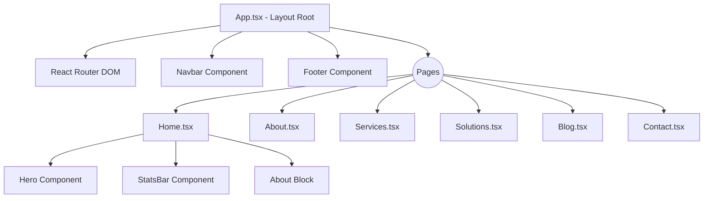

# Architecture du Projet

L'architecture du projet IntegralTech Frontend repose sur une séparation claire des responsabilités, un typage strict et une approche modulaire autour de React 19 et Vite.

## 🏗️ Architecture React

Nous utilisons une architecture par fonctionnalités (Feature-Based) couplée à une architecture de composants génériques.
Les vues principales sont isolées dans le dossier `/pages`, tandis que les briques visuelles réutilisables sont dans `/components`.

### Modèle de Données et État (State Management)
- L'état de l'application est volontairement local pour garantir de hautes performances et limiter les rendus inutiles.
- L'état global est principalement géré via React Router (URLs) et quelques états partagés ou levés (lifted state) dans des conteneurs comme `Navbar`.
- Les formulaires (ex. `ContactForm`) gèrent leurs propres états contrôlés (`useState`).

### Organisation des Composants
- **Dumb/Presentational Components** : S'occupent de l'affichage (ex. `CTA`, `StatsBar`). Ils reçoivent des données via les *props*.
- **Smart/Container Components** : Gèrent la logique métier (ex. `Navbar` avec la recherche, `ContactForm` avec la soumission).

### Hooks Personnalisés
Le dossier `/hooks` centralise la logique réutilisable, notamment pour les animations.
Exemple : `useRevealInView.ts` gère l'apparition des éléments lors du scroll à l'aide de l'Intersection Observer et GSAP.

### Le Layout Global
Un composant `App.tsx` enveloppe l'ensemble de l'application et sert de Layout principal :
- Il inclut la `TopBar` et la `Navbar` fixes.
- Il inclut le `<main>` qui utilise les routes.
- Il inclut le `Footer` global.

### Schéma d'Architecture Simplifié

## 🎨 Design System et Constantes
Les variables CSS et les constantes de couleur sont centralisées dans `src/constants.ts` :
- `DARK` : Bleu marine profond (#14243b / #0f2744)
- `ORANGE` : Couleur d'accentuation (#E67E22)
- `LIGHT_GRAY` : Fond de section clair (#F8F9FA)

Les polices utilisées sont **Open Sans** (corps de texte) et **Outfit** (titres).

## 🚀 GSAP et Animations
L'architecture d'animation repose sur un pattern spécifique pour React :
- Toujours utiliser `useLayoutEffect` (et non `useEffect`) pour les calculs GSAP afin d'éviter les scintillements.
- Utiliser `gsap.context()` pour englober les sélecteurs et s'assurer que `ctx.revert()` est appelé au démontage pour éviter les fuites de mémoire.

## 📱 Responsive Design
Le Responsive est géré de façon hybride :
- Des media queries dans `globals.css` (ex: pour cacher la `TopBar` ou gérer le `hamburger menu`).
- Des flexbox/grids dans les styles *inline* React avec des `width`/`maxWidth` en pourcentages (`100%`).
